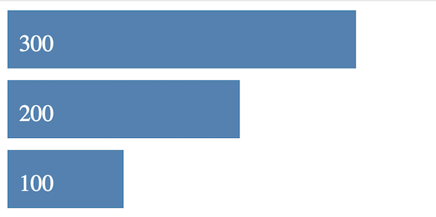
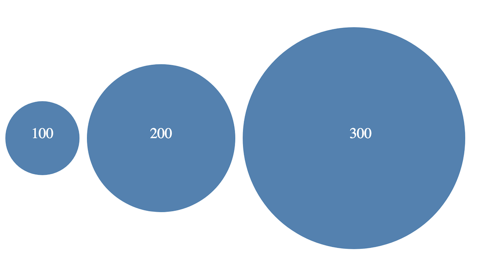
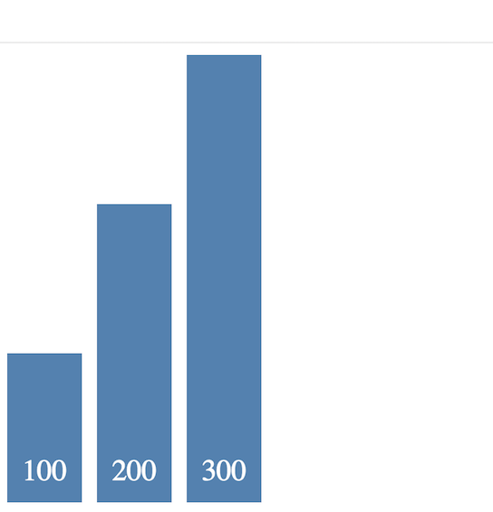

# SVG – Exercise 1

> Complete ALL the exercises in this section. Ask thomas.devine@lyit.ie for help.

## Part 1

1.	Examine and open the file [http://localhost/ajax/svgBarChart.html](http://localhost/ajax/svgBarChart.html)

	It uses *SVG* to render a simple bar chart.  

	Using your code editor experiment/change some of the values, colours, etc. to see the outcome

1.	Modify the code in ``svgBarChart.html`` so that bar chart looks like this:

	

	Set the ``<svg>`` width to 300.
x
1.	Create a file ``svgCircles.html`` to render this:

	

	The diameter of the circles are shown in the text values inside the circle.  Set the ``<svg>`` height to 300.

1.	Create a file ``svgColumnChart.html`` for a new SVG rendered *column chart* like this:

	

	Set the ``<svg>`` height to 300.

## Part 2

1.	Examine and open the code in [http://localhost/d3/svgBarChart2.html](http://localhost/d3/svgBarChart2.html) that uses SVG to render a simple bar chart dynamically using JavaScript.  
	
	Add another value to the ``data`` array and rerun the code.

1.	Modify the code so the output includes the text like this:

	

	Add the text dynamically using JavaScript.

